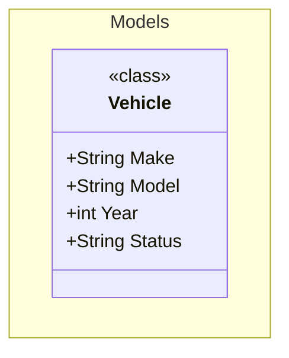

# mermaid-codegen

[](https://www.npmjs.com/package/mermaid-codegen)
[](https://github.com/ReneLombard/mermaid-codegen/actions/workflows/npm-publish-packages.yml)
[](https://www.npmjs.com/package/mermaid-codegen)
[](./LICENSE.md)
[](https://renelombard.github.io/mermaid-codegen/)

> Convert [Mermaid](https://mermaid.js.org/) class diagrams into source code using a documentation-first approach.

---

## 📚 Documentation

Full documentation is available at **[https://renelombard.github.io/mermaid-codegen/](https://renelombard.github.io/mermaid-codegen/)**

---

## ✨ Overview

`mermaid-codegen` is a CLI tool that bridges the gap between visual architecture diagrams and source code. It follows a **documentation-first** workflow:

1. **Design** your classes in a Mermaid class diagram
2. **Transform** the diagram into extensible YAML definitions
3. **Generate** source code from those YAML definitions using Handlebars templates
4. **Watch** for changes and automatically regenerate code

```
Mermaid Diagram  ──►  YAML Definitions  ──►  Source Code
    (.md)                 (.yml)              (.cs / etc.)
```

---

## 🚀 Getting Started

### Installation

Install `mermaid-codegen` globally via npm:

```bash
npm install -g mermaid-codegen
```

Verify the installation:

```bash
npx mermaid-codegen --help
```

### Quick Start (C#)

1. **Initialize** a new project with default scaffolding:

```bash
mermaid-codegen initialize -l C# -d ./blue-prints/C#
```

2. **Create** a Mermaid class diagram (e.g. `docs/fleet-management.md`):



3. **Transform** the diagram into YAML:

```bash
mermaid-codegen transform -i ./docs -o ./definitions
```

4. **Generate** source code from the YAML:

```bash
mermaid-codegen generate -i ./definitions -o ./src -t ./blue-prints/C#
```

5. **Watch** for changes and auto-regenerate:

```bash
mermaid-codegen watch -m ./docs -y ./definitions -o ./src --templates ./blue-prints/C#
```

---

## 🛠 Commands

| Command | Description |
|---|---|
| `initialize` | Scaffold a new project with default templates for a language |
| `transform` | Convert a Mermaid class diagram into YAML definition files |
| `generate` | Generate source code from YAML definitions using Handlebars templates |
| `watch` | Watch for changes and automatically regenerate YAML/code |
| `list-languages` | List all supported programming languages |

For full command reference, see the [Commands documentation](https://renelombard.github.io/mermaid-codegen/pages/commands).

---

## 📄 License

This project is licensed under the [MIT License](./LICENSE.md).

---

## 🤝 Contributing

Contributions are welcome! Please read [CONTRIBUTIONS.md](./CONTRIBUTIONS.md) to get started.