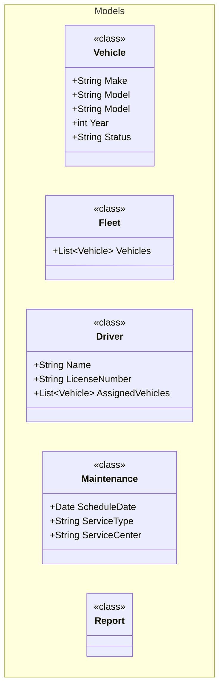

## What we will be creating

In this tutorial we will be creating a `vehicle fleet management` starting application written in C# (as the only current languge supported)

## Initializing the Application

Once the `mermaid-codegen` tool is installed (as described in the previous step), you can begin by setting up the default configuration within your application. 

## Folder structure

For this example we will be creating the folder structure as follows:

fleet-management/
├── definitions/           # (the intermediate code that is generated)
│   ├── *.Generated.yml
│   └── .yml <--- Custom definitions
├── blue-prints/c#      # (the Handlebars templates)
│   ├── class.hbs
│   └── interface.hbs
├── docs/
│   └── detailed-design/
|       └── fleet-design.md
└── src/
    └── models/
        └── <-- Source code to be generated

## Lets get started

### Configuring the C# webapi
Create the folder structure manually as described above `navigate to the ./src/` directory and initialize a `dotnet` project

Run the following command to create the project

```cmd
dotnet new webapi -n fleet-management -o .\ --use-controllers true
```
This should create a scaffolded webapi application. 

If everything went as expected you should be able to run the default application:

```cmd
dotnet run fleet-management.csproj
```

### Initializing mermaid-codegen app

With the terminal open, navigate to the root directory of fleet-management

Run the following command

```cmd
mermaid-codegen initialize -l C# -d .\blue-prints\C#
```

::: info
If your language is not supported out of the box, you can easily initialize it using the C# base and then customize and create your own templates from scratch.

Please try to contribute the templates to add more funcitionality in the tool.
:::


3. Upon execution, the following folders and files will be created:

- `blue-prints\c#\config.csharp.json`
- A set of [handlebars](https://handlebarsjs.com/) templates, such as `class.csharp.hbs` etc are created.

### Now lets start with creating your first mermaid diagram

For this we will start with simple [POCO](https://en.wikipedia.org/wiki/Plain_old_CLR_object) classes, describing the entities in the system.

1. Create a file `docs\detailed-design\fleet-management.md`

2. Once created lets start by creating our first model in the document


What you should notice is the annotation in the class, forexample, <<class>>

This annotation will map to the relevant hbs template. e.g. 
class.csharp.hbs <--- 

(hbs) -> It is a handlebars file 
(csharp) -> For language csharp
(class) -> for class annotation

3. Run the first step in the process of converting the mermaid class to generated (yml) files

```cmd
mermaid-codegen transform -i .\docs\detailed-design -o definitions
```

If all is good you will find the following files


fleet-management/
└── definitions/           # (the intermediate code that is generated)
    ├── Driver.Generated.yml
    ├── Fleet.Generated.yml
    ├── Maintenance.Generated.yml
    ├── Report.Generated.yml
    ├── Driver.Generated.yml
    └── Vehicle.Generated.yml 

These files provide an yml representation of the `classes`, 


```mermaid
classDiagram
namespace Models {
    class Vehicle {
        <<class>>
        +String Make
        +String Model
        +String Model
        +int Year
        +String Status
    }
```

would be represented as

```yml
Name: Driver
Namespace: Models
Type: class
Attributes:
  AssignedVehicles:
    Type: List~Vehicle~
    IsSystemType: true
    Scope: Public
  LicenseNumber:
    Type: String
    IsSystemType: true
    Scope: Public
  Name:
    Type: String
    IsSystemType: true
    Scope: Public
```

You could now extend the default mermaid classes with application specific fields (Think of max/min range attributes etc.) and add an additional file to the folder, without the Generated postfix to add additional info

4. You can now generate the code from the yml files like this:

```cmd
mermaid-codegen generate -i definitions -o src -t blue-prints\C#
```

Once this command is executed, you will see all the files are created in the followin location

fleet-management/
└── src/Models           # (the intermediate code that is generated)
    ├── Driver.Generated.cs
    ├── Fleet.Generated.cs
    ├── Maintenance.Generated.cs
    ├── Report.Generated.cs
    ├── Driver.Generated.cs
    └── Vehicle.Generated.cs

5. Building the source code

```cmd
dotnet run fleet-management.csproj
```

6. Lets add a minimum and maximum value annotation to the year model

Before we start lets start up the watch mode, so that it can monitor the changes of the yml and/or mermaid code and update the code accordingly

```cmd
mermaid-codegen watch -m docs\detailed-design -y definitions -o src --templates blue-prints\C#
```

With this running in the background lets check a few things:

Please open the following file `class.csharp.hbs`:

You would notice that there is already template support for attribute annotations, this can be extended to cater for your needs. 

```
{{#each Attributes}} 
    {{#if this.Annotations.Required}}
    {{#if this.Annotations.Required.AllowEmptyStrings}}[Required(AllowEmptyStrings = true)]{{else}}[Required]{{/if}}
    {{/if}}
    {{#if this.Annotations.NumberOfPlansIsValid}}
    [NumberOfPlansIsValid]
    {{/if}}
    {{#if this.Annotations.MaxLength}}
    [MaxLength({{this.Annotations.MaxLength.Length}}, ErrorMessage="{{this.Annotations.MaxLength.ErrorMessage}}")]
    {{/if}}
    {{#if this.Annotations.MinLength}}
    [MinLength({{this.Annotations.MinLength.Length}}, ErrorMessage="{{this.Annotations.MinLength.ErrorMessage}}")]
    {{/if}}
    {{#if this.Annotations.Range}}
    [Range({{this.Annotations.Range.Min}},{{this.Annotations.Range.Max}}{{#if this.Annotations.Range.ErrorMessage}}, ErrorMessage = "{{this.Annotations.Range.ErrorMessage}}"{{/if}})]
    {{/if}}
    public {{{this.Type}}} {{@key}} { get; set; }{{#if this.DefaultValue}} = {{#if (isEq this.DefaultValue "default")}}new(){{else}}{{{this.DefaultValue}}}{{/if}};{{/if}}

{{/each}}
```

Please also keep an eye on the `Vehicle.Generated.cs` file as we will add annotations.

Now you're first instinct would be to adapt the mermaid class diagram, however, there is no default flag for these annotations in its syntax, so lets copy the 
`Vehicle.Generated.yml` and remove its contents and replace it with

```yml

```


