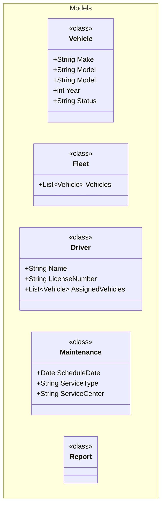

## What we will be creating

In this tutorial we will be creating a `vehicle fleet management` starting application written in C# (as the only current languge supported)

## Initializing the Application

Once the `mermaid-codegen` tool is installed (as described in the previous step), you can begin by setting up the default configuration within your application. 

## Folder structure

For this example we will be creating the folder structure as follows:

fleet-management/
├── definitions/           # (the intermediate code that is generated)
│   ├── *.Generated.yml
│   └── .yml <--- Custom definitions
├── blue-prints/c#      # (the Handlebars templates)
│   ├── class.hbs
│   └── interface.hbs
├── docs/
│   └── detailed-design/
|       └── fleet-design.md
└── src/
    └── models/
        └── <-- Source code to be generated

## Lets get started

### Configuring the C# webapi
Create the folder structure manually as described above `navigate to the ./src/` directory and initialize a `dotnet` project

Run the following command to create the project

```cmd
dotnet new webapi -n fleet-management -o .\ --use-controllers true
```
This should create a scaffolded webapi application. 

If everything went as expected you should be able to run the default application:

```cmd
dotnet run fleet-management.csproj
```

### Initializing mermaid-codegen app

With the terminal open, navigate to the root directory of fleet-management

Run the following command

```cmd
mermaid-codegen initialize -l C# -d .\blue-prints\C#
```

::: info
If your language is not supported out of the box, you can easily initialize it using the C# base and then customize and create your own templates from scratch.

Please try to contribute the templates to add more funcitionality in the tool.
:::


3. Upon execution, the following folders and files will be created:

- `blue-prints\c#\config.csharp.json`
- A set of [handlebars](https://handlebarsjs.com/) templates, such as `class.csharp.hbs` etc are created.

### Now lets start with creating your first mermaid diagram

For this we will start with simple [POCO](https://en.wikipedia.org/wiki/Plain_old_CLR_object) classes, describing the entities in the system.

1. Create a file `docs\detailed-design\fleet-management.md`

2. Once created lets start by creating our first model in the document


What you should notice is the annotation in the class, forexample, <<class>>

This annotation will map to the relevant hbs template. e.g. 
class.csharp.hbs <--- 

(hbs) -> It is a handlebars file 
(csharp) -> For language csharp
(class) -> for class annotation

3. Run the first step in the process of converting the mermaid class to generated (yml) files

```cmd
