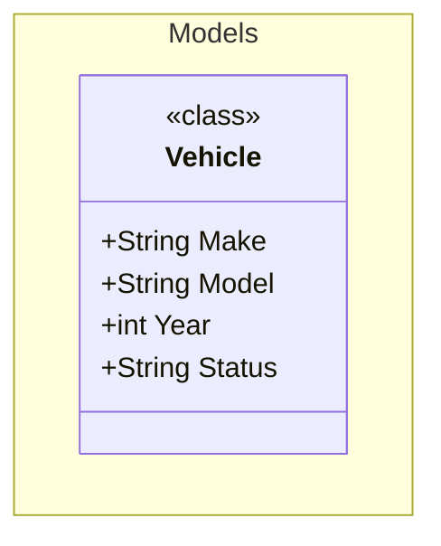

# Getting Started

## What You Will Build

In this tutorial, you will run a complete Mermaid-to-code workflow for C#:

1. Initialize a project scaffold.
2. Create a Mermaid class diagram.
3. Transform the diagram into YAML.
4. Generate C# code from YAML.
5. Optionally run watch mode for iterative updates.

**Examples** use POSIX-style relative paths (for example `./docs`). On Windows, equivalent backslash paths also work.

## Prerequisites

.NET 10 installed

## Canonical First-Run Workflow

### 1. Initialize a project scaffold

Run from the folder where you want your project folder to be created:

```bash
npx mermaid-codegen initialize -l C# -d fleet-management
```

This creates a project scaffold like:

```text
fleet-management/
├── Templates/
│   └── C#/
│       ├── class.csharp.hbs
│       ├── endpoint.csharp.hbs
│       ├── interface.csharp.hbs
│       ├── enumeration.csharp.hbs
│       ├── storage.csharp.hbs
│       └── config.json
└── config.json
```

Change into the project root before continuing:

```bash
cd fleet-management
```

Create a directory for the source code

```text
fleet-management/
├── Src/
│   └── Models/
└── Docs/
    └── detailed-design
```

Initialize the web project for the files

```
dotnet new webapi -n fleet-management -o .\Src --use-controllers true
```

### 2. Create your first Mermaid diagram

Create `Docs/detailed-design/vehicle.md`:


```mermaid
classDiagram
namespace Models {
    class Vehicle {
        <<class>>
        +String Make
        +String Model
        +int Year
        +String Status
    }
}
```

````markdown

```mermaid
classDiagram
namespace Models {
    class Vehicle {
        <<class>>
        +String Make
        +String Model
        +int Year
        +String Status
    }
}
```
````

### 3. Transform Mermaid into YAML

```bash
npx mermaid-codegen transform -i ./docs/detailed-design -o ./Definitions
```

Expected artifact:

```text
Definitions/Models/Vehicle.Generated.yml
```

### 4. Generate code from YAML

```bash
npx mermaid-codegen generate -i ./Definitions -o ./Src -t ./Templates/C#
```

Expected artifact:

```text
Src/Models/Vehicle.Generated.cs
```

### 5. Verify success

Required checks:

1. `Definitions/Models/Vehicle.Generated.yml` exists.
2. `Src/Models/Vehicle.Generated.cs` exists.

Optional build validation (if .NET SDK is available):

```bash
dotnet build ./Src
```

## Optional: Watch Mode For Iterative Development

After your first successful transform and generate flow, you can run watch mode.

Simplified syntax (recommended for getting started):

```bash
npx mermaid-codegen watch --input-dir=./docs/detailed-design --output-dir=./src/Models
```

Detailed syntax is documented on the Commands page for advanced control.

## Next Step

Continue with the language/template configuration details in the next page.

```

```
