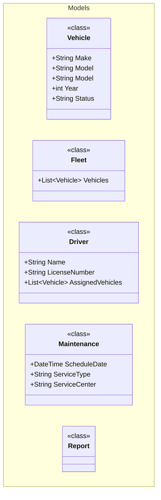
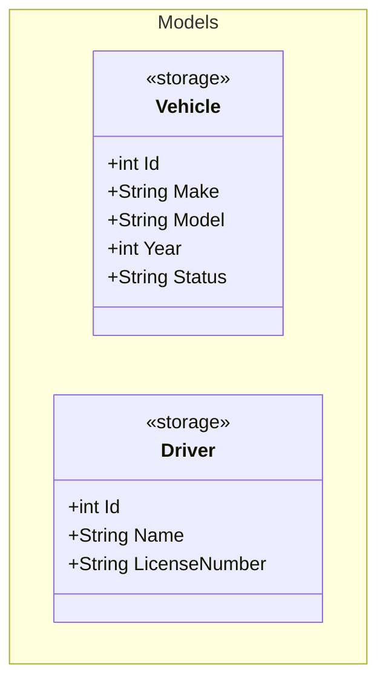

## What we will be creating

In this tutorial we will be creating a **vehicle fleet management* *starting application written in C# (as the only current languge supported)

## Initializing the Application

Once the **mermaid-codegen** tool is installed (as described in the previous step), you can begin by setting up the default configuration within your application. 

## Folder structure

For this example we will be creating the folder structure as follows:
```
fleet-management/
├── definitions/        # (the intermediate code that is generated)
│   ├── *.Generated.yml
│   └── .yml <--- Custom definitions
├── blue-prints/c#      # (the Handlebars templates)
│   ├── class.hbs
│   └── interface.hbs
├── docs/
│   └── detailed-design/
|       └── fleet-design.md
└── src/
    └── models/
        └── <-- Source code to be generated
```


## Lets get started

### Configuring the C# webapi
Create the folder structure manually as described above **navigate to the ./src/** directory and initialize a **dotnet** project

Run the following command to create the project

```
dotnet new webapi -n fleet-management -o .\ --use-controllers true
```
This should create a scaffolded webapi application. 

If everything went as expected you should be able to run the default application:

```
dotnet run fleet-management.csproj
```

### Initializing mermaid-codegen app

With the terminal open, navigate to the root directory of fleet-management

Run the following command

```cmd
mermaid-codegen initialize -l C# -d .\blue-prints\C#
```

::: info
If your language is not supported out of the box, you can easily initialize it using the C# base and then customize and create your own templates from scratch.

Please try to contribute the templates to add more funcitionality in the tool.
:::


3. Upon execution, the following folders and files will be created:

**blueprints/c#/config.csharp.json**

A set of [handlebars](https://handlebarsjs.com/) templates, such as **class.csharp.hbs** etc are created.

### Now lets start with creating your first mermaid diagram

For this we will start with simple [POCO](https://en.wikipedia.org/wiki/Plain_old_CLR_object) classes, describing the entities in the system.

1. Create a file `docs\detailed-design\fleet-management.md`
2. Once created lets start by creating our first model in the document


```mermaid
classDiagram
namespace Models {
    class Vehicle {
        <<class>>
        +String Make
        +String Model
        +String Model
        +int Year
        +String Status
    }

    class Fleet {
        <<class>>
        +List~Vehicle~ Vehicles
    }

    class Driver {
        <<class>>
        +String Name
        +String LicenseNumber
        +List~Vehicle~ AssignedVehicles
    }

    class Maintenance {
        <<class>>
        +DateTime ScheduleDate
        +String ServiceType
        +String ServiceCenter
    }

    class Report {
        <<class>>
    }
}
```

What you should notice is the annotation in the class, forexample, `<<class>>`


This annotation will map to the relevant hbs template. e.g. 
class.csharp.hbs

(hbs) -> It is a handlebars file 
(csharp) -> For language csharp
(class) -> for mermaid class annotation

3. Run the first step in the process of converting the mermaid class to generated (yml) files

```cmd
mermaid-codegen transform -i .\docs\detailed-design -o definitions
```

If all is good you will find the following files

```
fleet-management/
└── definitions/           # (the intermediate code that is generated)
    ├── Driver.Generated.yml
    ├── Fleet.Generated.yml
    ├── Maintenance.Generated.yml
    ├── Report.Generated.yml
    ├── Driver.Generated.yml
    └── Vehicle.Generated.yml 
```
These files provide an yml representation of the `classes`, 


```mermaid
classDiagram
namespace Models {
    class Vehicle {
        <<class>>
        +String Make
        +String Model
        +String Model
        +int Year
        +String Status
    }
```

would be represented as

```yml
Name: Vehicle
Namespace: Models
Type: class
Attributes:
  Make:
    Type: String
    IsSystemType: true
    Scope: Public
  Model:
    Type: String
    IsSystemType: true
    Scope: Public
  Year:
    Type: int
    IsSystemType: false
    Scope: Public
  Status:
    Type: String
    IsSystemType: true
    Scope: Public
```


4. You can now generate the code from the yml files like this:


```cmd
mermaid-codegen generate -i definitions -o src -t blue-prints\C#
```

Once this command is executed, you will see all the files are created in the following location

```tree
fleet-management/
└── src/Models           # (the intermediate code that is generated)
    ├── Driver.Generated.cs
    ├── Fleet.Generated.cs
    ├── Maintenance.Generated.cs
    ├── Report.Generated.cs
    ├── Driver.Generated.cs
    └── Vehicle.Generated.cs
```
5. Building the source code

```cmd
dotnet run fleet-management.csproj
```

6. Lets add a minimum and maximum value annotation to the year model

Before we start lets start up the watch mode, so that it can monitor the changes of the yml and/or mermaid code and update the code accordingly

```cmd
mermaid-codegen watch -m docs\detailed-design -y definitions -o ".\src" --templates blue-prints\C#
```

With this running in the background lets check a few things:

Please open the following file 
```
class.csharp.hbs
```

You would notice that there is already template support for attribute annotations, this can be extended to cater for your needs. 

```handlebars
{{#each Attributes}} 
    {{#if this.Annotations.Required}}
    {{#if this.Annotations.Required.AllowEmptyStrings}}[Required(AllowEmptyStrings = true)]{{else}}[Required]{{/if}}
    {{/if}}
    {{#if this.Annotations.MaxLength}}
    [MaxLength({{this.Annotations.MaxLength.Length}}, ErrorMessage="{{this.Annotations.MaxLength.ErrorMessage}}")]
    {{/if}}
    {{#if this.Annotations.MinLength}}
    [MinLength({{this.Annotations.MinLength.Length}}, ErrorMessage="{{this.Annotations.MinLength.ErrorMessage}}")]
    {{/if}}
    {{#if this.Annotations.Range}}
    [Range({{this.Annotations.Range.Min}},{{this.Annotations.Range.Max}}{{#if this.Annotations.Range.ErrorMessage}}, ErrorMessage = "{{this.Annotations.Range.ErrorMessage}}"{{/if}})]
    {{/if}}
    public {{{this.Type}}} {{@key}} { get; set; }{{#if this.DefaultValue}} = {{#if (isEq this.DefaultValue "default")}}new(){{else}}{{{this.DefaultValue}}}{{/if}};{{/if}}

{{/each}}
```

Please also keep an eye on the 
*Vehicle.Generated.cs* file as we will add annotations.

Now you're first instinct would be to adapt the mermaid class diagram, however, there is no default flag for these annotations in its syntax, so lets copy the 
*Vehicle.Generated.yml* and rename to *Vehicle.yml* and remove its contents and replace it with

```yml
Name: Vehicle
Usings:
  - System.ComponentModel.DataAnnotations
Type: class
Attributes:
  Year:
    Annotations:
      MaxLength:
        Length: 2100
        ErrorMessage: "Year must be less than 2100"
      MinLength:
        Length: 1900
        ErrorMessage: "Year must be greater than 1900"

```


The folder should contain the following files now:
```
fleet-management/
└── definitions/           # (the intermediate code that is generated)
    ├── Driver.Generated.yml
    ├── Fleet.Generated.yml
    ├── Maintenance.Generated.yml
    ├── Report.Generated.yml
    ├── Driver.Generated.yml
    ├── Vehicle.yml <--- New custom file
    └── Vehicle.Generated.yml
```


The above yml code will then result in the following *DataAnnotations* in C#

```csharp
using System;
using System.Collections.Generic;

namespace Models;

public partial class Vehicle 
{

    [MaxLength(2100, ErrorMessage="Year must be less than 2100")]
    [MinLength(1900, ErrorMessage="Year must be greater than 1900")]
    public int Year { get; set; }

    public string Status { get; set; }

    public string Model { get; set; }

    public string Make { get; set; }

}
```

Next up, we will configure an endpoint and services

## Adding Entity Framework Core Support

Now that we have our POCO models from `<<class>>`, we can use the `<<storage>>` annotation to generate EF Core entity models — the same structure but enriched with persistence annotations like `[Key]`, `[Column]`, `[ForeignKey]`, and `virtual` navigation properties.

### 7. Mark entities as storage models in the Mermaid diagram

Update `docs/detailed-design/fleet-management.md` to use `<<storage>>` instead of `<<class>>` for entities that need persistence:


```mermaid
classDiagram
namespace Models {
    class Vehicle {
        <<storage>>
        +int Id
        +String Make
        +String Model
        +int Year
        +String Status
    }

    class Driver {
        <<storage>>
        +int Id
        +String Name
        +String LicenseNumber
    }
}
```

Run the transform command again:

```cmd
mermaid-codegen transform -i .\docs\detailed-design -o definitions
```

The generated YAML (e.g. `definitions/Models/Vehicle.Generated.yml`) will have `Type: storage` instead of `Type: class`.

### 8. Generate the EF Core entity models

```cmd
mermaid-codegen generate -i definitions -o src -t blue-prints\C#
```

This produces `src/Models/Vehicle.Generated.cs` using `storage.csharp.hbs`, which includes all EF Core usings automatically:

```csharp
using System;
using System.Collections.Generic;
using System.ComponentModel.DataAnnotations;
using System.ComponentModel.DataAnnotations.Schema;
using Microsoft.EntityFrameworkCore;

namespace Models;

public partial class Vehicle
{
    public int Id { get; set; }
    public string Make { get; set; }
    public string Model { get; set; }
    public int Year { get; set; }
    public string Status { get; set; }
}
```

### 9. Add EF Core annotations to the Vehicle entity

Copy `definitions/Models/Vehicle.Generated.yml` to `definitions/Models/Vehicle.yml` and add EF Core-specific annotations:

```yml
Name: Vehicle
Usings:
  - System.ComponentModel.DataAnnotations
  - System.ComponentModel.DataAnnotations.Schema
Type: storage
Annotations:
  Table:
    Name: vehicles
    Schema: fleet
Attributes:
  Id:
    Annotations:
      Key: true
      DatabaseGenerated: Identity
  Make:
    Annotations:
      Required: true
      Column:
        Name: make
      MaxLength:
        Length: 100
        ErrorMessage: "Make must be 100 characters or less"
  Year:
    Annotations:
      Range:
        Min: 1900
        Max: 2100
        ErrorMessage: "Year must be between 1900 and 2100"
```

After regenerating, `Vehicle.Generated.cs` will include the EF Core data annotations:

```csharp
using System;
using System.Collections.Generic;
using System.ComponentModel.DataAnnotations;
using System.ComponentModel.DataAnnotations.Schema;
using Microsoft.EntityFrameworkCore;

namespace Models;

[Table("vehicles", Schema = "fleet")]
public partial class Vehicle
{
    [Key]
    [DatabaseGenerated(DatabaseGeneratedOption.Identity)]
    public int Id { get; set; }

    [Required]
    [Column("make")]
    [MaxLength(100, ErrorMessage="Make must be 100 characters or less")]
    public string Make { get; set; }

    [Range(1900,2100, ErrorMessage = "Year must be between 1900 and 2100")]
    public int Year { get; set; }

    public string Status { get; set; }

    public string Model { get; set; }
}
```

### 10. Write a DbContext referencing the generated entities

The generated entity models are used as-is in a hand-written `DbContext`. Add it to your project:

```csharp
// src/Data/FleetDbContext.cs
using Microsoft.EntityFrameworkCore;

public class FleetDbContext : DbContext
{
    public FleetDbContext(DbContextOptions<FleetDbContext> options) : base(options) { }

    public DbSet<Vehicle> Vehicles { get; set; } = null!;
    public DbSet<Driver> Drivers { get; set; } = null!;
}
```

Install EF Core packages and register the context in `Program.cs`:

```cmd
dotnet add package Microsoft.EntityFrameworkCore.SqlServer
dotnet add package Microsoft.EntityFrameworkCore.Tools
```

```csharp
builder.Services.AddDbContext<FleetDbContext>(options =>
    options.UseSqlServer(builder.Configuration.GetConnectionString("DefaultConnection")));
```

Add the connection string to `appsettings.json`:

```json
{
  "ConnectionStrings": {
    "DefaultConnection": "Server=(localdb)\\mssqllocaldb;Database=FleetManagement;Trusted_Connection=True;"
  }
}
```

### 11. Run migrations

```cmd
dotnet ef migrations add InitialCreate
dotnet ef database update
```

### 12. Build and run

```cmd
dotnet build fleet-management.csproj
dotnet run fleet-management.csproj
```

The fleet management API is now backed by Entity Framework Core. For more details on all supported EF Core annotations, see the [Storage & Entity Framework](./storage-and-entity-framework) reference page.