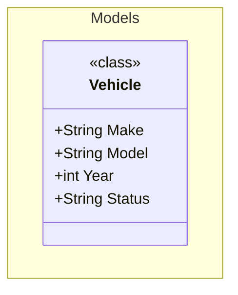
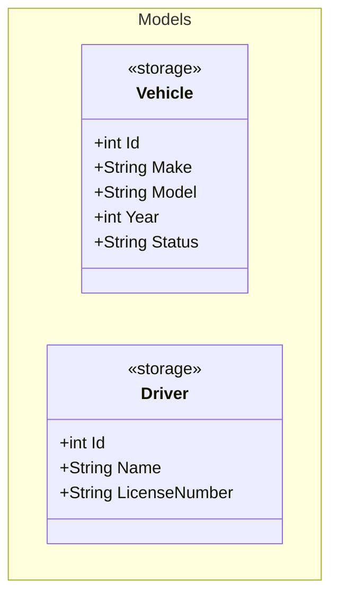

# Getting Started

## What You Will Build

In this tutorial, you will run a complete Mermaid-to-code workflow for C#:

1. Initialize a project scaffold.
2. Create a Mermaid class diagram.
3. Transform the diagram into YAML.
4. Generate C# code from YAML.
5. Optionally run watch mode for iterative updates.

**Examples** use POSIX-style relative paths (for example `./docs`). On Windows, equivalent backslash paths also work.

## Prerequisites

.NET 10 installed

## Canonical First-Run Workflow

### 1. Initialize a project scaffold

Run from the folder where you want your project folder to be created:

```bash
npx mermaid-codegen initialize -l C# -d fleet-management
```

This creates a project scaffold like:

```text
fleet-management/
├── Templates/
│   └── C#/
│       ├── class.csharp.hbs
│       ├── endpoint.csharp.hbs
│       ├── interface.csharp.hbs
│       ├── enumeration.csharp.hbs
│       ├── storage.csharp.hbs
│       └── config.json
└── mermaid-codegen.config.json
```

Change into the project root before continuing:

```bash
cd fleet-management
```

Create a directory for the source code

```text
fleet-management/
├── Src/
│   └── Models/
└── Docs/
    └── detailed-design
```

Initialize the web project for the files

```
dotnet new webapi -n fleet-management -o .\Src --use-controllers true
```

### 2. Create your first Mermaid diagram

Create `Docs/detailed-design/vehicle.md`:


```mermaid
classDiagram
namespace Models {
    class Vehicle {
        <<class>>
        +String Make
        +String Model
        +int Year
        +String Status
    }
}
```

````markdown

```mermaid
classDiagram
namespace Models {
    class Vehicle {
        <<class>>
        +String Make
        +String Model
        +int Year
        +String Status
    }
}
```
````

### 3. Transform Mermaid into YAML

```bash
npx mermaid-codegen transform -i ./docs/detailed-design -o ./Definitions
```

Expected artifact:

```text
Definitions/Models/Vehicle.Generated.yml
```

### 4. Generate code from YAML

```bash
npx mermaid-codegen generate -i ./Definitions -o ./Src -t ./Templates/C#
```

Expected artifact:

```text
Src/Models/Vehicle.Generated.cs
```

### 5. Verify success

Required checks:

1. `Definitions/Models/Vehicle.Generated.yml` exists.
2. `Src/Models/Vehicle.Generated.cs` exists.

Optional build validation (if .NET SDK is available):

```bash
dotnet build ./Src
```

## Optional: Watch Mode For Iterative Development

After your first successful transform and generate flow, you can run watch mode.

Config mode (recommended) — no flags needed, all paths come from `mermaid-codegen.config.json`:

```bash
npx mermaid-codegen watch
```

Explicit mode — specify all paths directly, config file is not read:

```bash
npx mermaid-codegen watch -m ./docs/detailed-design -y ./Definitions -o ./Src --templates ./Templates/C#
```

Detailed syntax options are documented on the Commands page.

## Next Step

Continue with the language/template configuration details in the next page.

## Adding Entity Framework Core Support

Now that we have our POCO models from `<<class>>`, we can use the `<<storage>>` annotation to generate EF Core entity models — the same structure but enriched with persistence annotations like `[Key]`, `[Column]`, `[ForeignKey]`, and `virtual` navigation properties.

### 6. Mark entities as storage models in the Mermaid diagram

Update `docs/detailed-design/fleet-management.md` to use `<<storage>>` instead of `<<class>>` for entities that need persistence:


```mermaid
classDiagram
namespace Models {
    class Vehicle {
        <<storage>>
        +int Id
        +String Make
        +String Model
        +int Year
        +String Status
    }

    class Driver {
        <<storage>>
        +int Id
        +String Name
        +String LicenseNumber
    }
}
```

Run the transform command again:

```bash
npx mermaid-codegen transform -i ./Docs/detailed-design -o ./Definitions
```

The generated YAML (e.g. `Definitions/Models/Vehicle.Generated.yml`) will have `Type: storage` instead of `Type: class`.

### 7. Generate the EF Core entity models

```bash
npx mermaid-codegen generate -i ./Definitions -o ./Src -t ./Templates/C#
```

This produces `Src/Models/Vehicle.Generated.cs` using `storage.csharp.hbs`, which includes all EF Core usings automatically:

```csharp
using System;
using System.Collections.Generic;
using System.ComponentModel.DataAnnotations;
using System.ComponentModel.DataAnnotations.Schema;
using Microsoft.EntityFrameworkCore;

namespace Models;

public partial class Vehicle
{
    public int Id { get; set; }
    public string Make { get; set; }
    public string Model { get; set; }
    public int Year { get; set; }
    public string Status { get; set; }
}
```

### 8. Add EF Core annotations to the Vehicle entity

Copy `Definitions/Models/Vehicle.Generated.yml` to `Definitions/Models/Vehicle.Custom.yml` and add EF Core-specific annotations:

```yml
Name: Vehicle
Type: storage
Annotations:
  Table:
    Name: vehicles
    Schema: fleet
Attributes:
  Id:
    Annotations:
      Key: true
      DatabaseGenerated: Identity
  Make:
    Annotations:
      Required: true
      Column:
        Name: make
      MaxLength:
        Length: 100
        ErrorMessage: "Make must be 100 characters or less"
  Year:
    Annotations:
      Range:
        Min: 1900
        Max: 2100
        ErrorMessage: "Year must be between 1900 and 2100"
```

After regenerating, `Vehicle.Generated.cs` will include the EF Core data annotations:

```csharp
using System;
using System.Collections.Generic;
using System.ComponentModel.DataAnnotations;
using System.ComponentModel.DataAnnotations.Schema;
using Microsoft.EntityFrameworkCore;

namespace Models;

[Table("vehicles", Schema = "fleet")]
public partial class Vehicle
{
    [Key]
    [DatabaseGenerated(DatabaseGeneratedOption.Identity)]
    public int Id { get; set; }

    [Required]
    [Column("make")]
    [MaxLength(100, ErrorMessage="Make must be 100 characters or less")]
    public string Make { get; set; }

    [Range(1900,2100, ErrorMessage = "Year must be between 1900 and 2100")]
    public int Year { get; set; }

    public string Status { get; set; }

    public string Model { get; set; }
}
```

### 9. Write a DbContext referencing the generated entities

The generated entity models are used as-is in a hand-written `DbContext`. Add it to your project:

```csharp
// Src/Data/FleetDbContext.cs
using Microsoft.EntityFrameworkCore;

public class FleetDbContext : DbContext
{
    public FleetDbContext(DbContextOptions<FleetDbContext> options) : base(options) { }

    public DbSet<Vehicle> Vehicles { get; set; } = null!;
    public DbSet<Driver> Drivers { get; set; } = null!;
}
```

Install EF Core packages and register the context in `Program.cs`:

```bash
dotnet add package Microsoft.EntityFrameworkCore.SqlServer
dotnet add package Microsoft.EntityFrameworkCore.Tools
```

```csharp
builder.Services.AddDbContext<FleetDbContext>(options =>
    options.UseSqlServer(builder.Configuration.GetConnectionString("DefaultConnection")));
```

Add the connection string to `appsettings.json`:

```json
{
  "ConnectionStrings": {
    "DefaultConnection": "Server=(localdb)\\mssqllocaldb;Database=FleetManagement;Trusted_Connection=True;"
  }
}
```

### 10. Run migrations

```bash
dotnet ef migrations add InitialCreate
dotnet ef database update
```

### 11. Build and run

```bash
dotnet build ./Src
dotnet run
```

The fleet management API is now backed by Entity Framework Core. For more details on all supported EF Core annotations, see the [Storage & Entity Framework](./storage-and-entity-framework) reference page.
