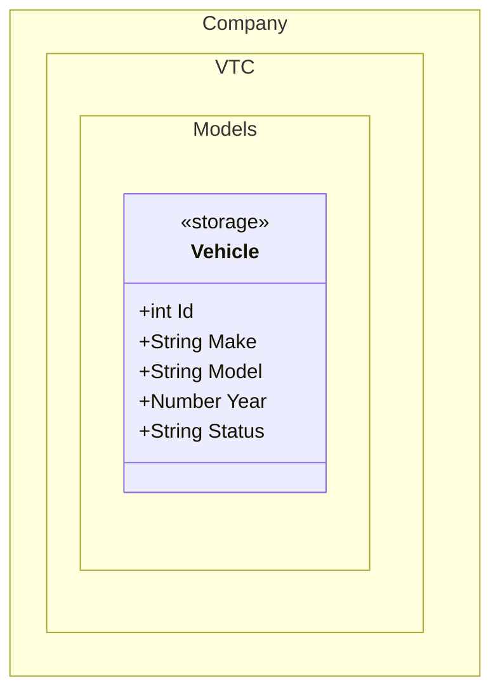
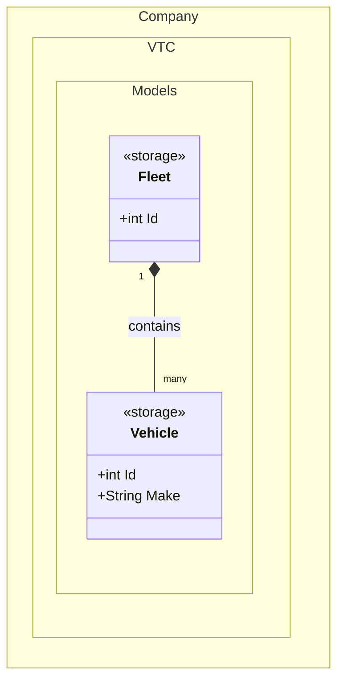

# Storage & Entity Framework Support

`mermaid-codegen` supports generating [Entity Framework Core](https://learn.microsoft.com/en-us/ef/core/) annotated entity model classes directly from Mermaid class diagrams via the `<<storage>>` annotation.

## The `<<storage>>` vs `<<class>>` Annotation

| Annotation | Template | Use for |
|---|---|---|
| `<<class>>` | `class.csharp.hbs` | Plain POCO — no persistence concerns |
| `<<storage>>` | `storage.csharp.hbs` | EF Core entity model — table mapping, keys, relationships |

A class marked `<<storage>>` produces the same structure as `<<class>>` but with all EF Core data annotation support built in: `[Table]`, `[Key]`, `[DatabaseGenerated]`, `[Column]`, `[ForeignKey]`, `[NotMapped]`, and navigation properties declared as `virtual` for lazy loading.

## Basic Entity Example



After `mermaid-codegen transform` and `mermaid-codegen generate` this produces a plain EF-ready entity:

```csharp
using System;
using System.Collections.Generic;
using System.ComponentModel.DataAnnotations;
using System.ComponentModel.DataAnnotations.Schema;
using Microsoft.EntityFrameworkCore;

namespace Company.VTC.Models;

public partial class Vehicle
{
    public int Id { get; set; }
    public string Make { get; set; }
    public string Model { get; set; }
    public int Year { get; set; }
    public string Status { get; set; }
}
```

## EF Core Data Annotations via YAML

Because Mermaid diagrams have no native syntax for persistence metadata, EF Core annotations are added through the intermediate YAML override file.

### Supported Annotations

| Annotation | YAML Key | Description |
|---|---|---|
| `[Table("name")]` | `Annotations.Table.Name` | Maps entity to a specific table name |
| `[Table("name", Schema = "schema")]` | `Annotations.Table.Schema` | Includes schema qualifier |
| `[Key]` | `Annotations.Key: true` | Marks property as primary key |
| `[DatabaseGenerated(…)]` | `Annotations.DatabaseGenerated` | `Identity`, `Computed`, or `None` |
| `[Column("name")]` | `Annotations.Column.Name` | Maps property to a specific column name |
| `[Column(Order = n)]` | `Annotations.Column.Order` | Sets column order in a composite key |
| `[ForeignKey("prop")]` | `Annotations.ForeignKey.Name` | Declares a foreign key shadow property |
| `[NotMapped]` | `Annotations.NotMapped: true` | Excludes property from EF mapping |
| `[Required]` | `Annotations.Required: true` | Makes column non-nullable |
| `[MaxLength(n)]` | `Annotations.MaxLength.Length` | Sets maximum column length |
| `[MinLength(n)]` | `Annotations.MinLength.Length` | Sets minimum length validation |
| `[Range(min, max)]` | `Annotations.Range.Min / Max` | Numeric range validation |

### Full Annotation Example

Copy `Vehicle.Generated.yml` to `Vehicle.yml` and add the annotations you need:

```yml
Name: Vehicle
Namespace: Company.VTC.Models
Usings:
  - System.ComponentModel.DataAnnotations
  - System.ComponentModel.DataAnnotations.Schema
Type: storage
Annotations:
  Table:
    Name: vehicles
    Schema: fleet
Attributes:
  Id:
    Type: int
    Scope: Public
    Annotations:
      Key: true
      DatabaseGenerated: Identity
  Make:
    Type: String
    Scope: Public
    Annotations:
      Required: true
      Column:
        Name: make
      MaxLength:
        Length: 100
        ErrorMessage: "Make cannot exceed 100 characters"
  VinNumber:
    Type: String
    Scope: Public
    Annotations:
      Column:
        Name: vin_number
      Required: true
      MaxLength:
        Length: 17
        ErrorMessage: "VIN must be exactly 17 characters"
  InternalNote:
    Type: String
    Scope: Public
    Annotations:
      NotMapped: true
  Year:
    Type: Number
    Scope: Public
    Annotations:
      Range:
        Min: 1900
        Max: 2100
        ErrorMessage: "Year must be between 1900 and 2100"
```

This produces:

```csharp
using System;
using System.Collections.Generic;
using System.ComponentModel.DataAnnotations;
using System.ComponentModel.DataAnnotations.Schema;
using Microsoft.EntityFrameworkCore;

namespace Company.VTC.Models;

[Table("vehicles", Schema = "fleet")]
public partial class Vehicle
{
    [Key]
    [DatabaseGenerated(DatabaseGeneratedOption.Identity)]
    public int Id { get; set; }

    [Required]
    [Column("make")]
    [MaxLength(100, ErrorMessage="Make cannot exceed 100 characters")]
    public string Make { get; set; }

    [Column("vin_number")]
    [Required]
    [MaxLength(17, ErrorMessage="VIN must be exactly 17 characters")]
    public string VinNumber { get; set; }

    [NotMapped]
    public string InternalNote { get; set; }

    [Range(1900,2100, ErrorMessage = "Year must be between 1900 and 2100")]
    public int Year { get; set; }
}
```

## Navigation Properties

Relationships defined via compositions or aggregations are rendered as `virtual` navigation properties, enabling EF Core lazy loading:



The generated `Fleet` entity will include:

```csharp
public virtual ICollection<Vehicle> Vehicle { get; set; } = new List<Vehicle>();
```

## Wiring Up the DbContext

The `<<storage>>` template generates the entity models. You still create your `DbContext` manually (or use a separate pattern), for example:

```csharp
// FleetDbContext.cs (handwritten)
public class FleetDbContext : DbContext
{
    public FleetDbContext(DbContextOptions<FleetDbContext> options) : base(options) { }

    public DbSet<Vehicle> Vehicles { get; set; } = null!;
    public DbSet<Driver> Drivers { get; set; } = null!;
}
```

Register in `Program.cs`:

```csharp
builder.Services.AddDbContext<FleetDbContext>(options =>
    options.UseSqlServer(builder.Configuration.GetConnectionString("DefaultConnection")));
```

## Full Workflow Summary

1. **Design** your entities in the Mermaid diagram with `<<storage>>`
2. **Transform**: `mermaid-codegen transform -i docs/detailed-design -o definitions`
3. **Annotate** (optional): copy the generated YAML and add EF Core annotations
4. **Generate**: `mermaid-codegen generate -i definitions -o src -t blue-prints/C#`
5. **Write** your `DbContext` referencing the generated entity types
6. **Migrate**: `dotnet ef migrations add InitialCreate && dotnet ef database update`
