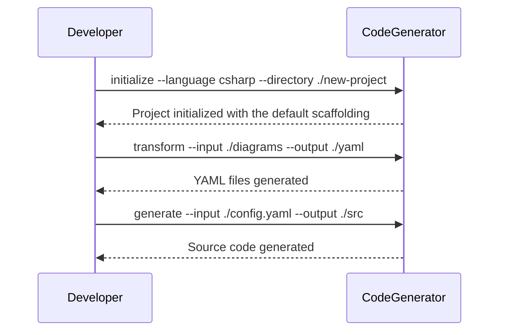
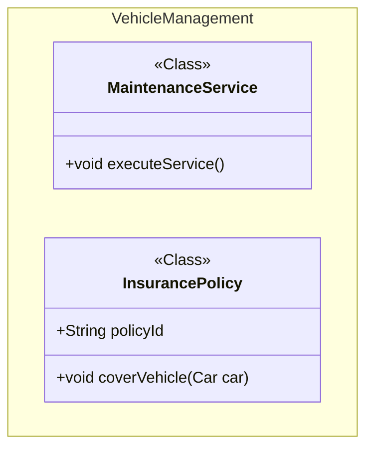

# Overview

## Introduction

The Mermaid to code generator tool provides a middle ground between your source code and the Mermaid [class](https://mermaid.js.org/syntax/classDiagram.html) diagrams.

## Documentation First Approach

mermaid-to-code embraces a documentation-first approach, by creating visual diagrams and documentation before generating code.

This approach ensures that the design and architecture are well-documented and agreed upon before implementation begins. By converting these diagrams into machine-readable configurations and then into source code, mermaid-to-code helps maintain consistency between documentation and implementation.

## Why the YML middleware

The mermaid class diagrams are quite limited to the type of data that you can enter within the diagram. It gives a great overview of the classes and the interactions surrounding them. However, in most cases you might want to give more information in the actual code base. Forexample, code comments etc.

The intermediatary YML structure provides a means to extend the the classdiagram to provide more information on which you can add more information.

## Flow Explained



### Intializing a project

The initialize creates all the default scaffolding required to get you up and running with the `mermaid-to-code` tool.
You can specify the language that you would like to provide the default templates for. These templates can be extended for you specific language requirements. 
You also potentially use it to generate documents rather then just code, but that is up to you.

### Explaining by example

Suppose you have the following mermaid class diagram



When running the `npx mermaid-to-code transform` command you convert this classdiagram to 2 seperate yml files:

`MaintenanceService.Generated.yml`

```yml
Name: MaintenanceService
Namespace: VehicleManagement
Type: Class
Methods:
  executeService:
    ReturnType: void
    Scope: Public
```

and `InsurancePolicy.Generated.yml`

```yml
Name: InsurancePolicy
Namespace: VehicleManagement
Type: Class
Attributes:
  policyId:
    Type: String
    IsSystemType: !!bool False
    Scope: Public
Methods:
  coverVehicle:
    ReturnType: void
    Scope: Public
    Parameters:
      Car:
        Type: car
```

You could potentially extend the yml by providing an additional custom yml file
`InsurancePolicy.yml` with the additional field that you want to be used in your handlebars template

e.g.

```yml
Name: InsurancePolicy
Type: Class
Methods:
  coverVehicle:
    AuthorizedUser: Manager 
```

When running the `npx mermaid-to-code` tool it will merge these two yml fields for more information.

As part of the tool initialization it created default handlebars templates per language for example

`class.csharp.hbs`

The class corresponds to the `type` in the yml and the `<<Class>>` tag in the classdiagram

When the `npx mermaid-to-code` generate command is executed it will map the annotation with the hbs file.

forexample if you have the following handlebars template
`class.csharp.hbs`


```code
Name: {{Name}}
Type: {{Type}}

Attributes:
{{#each Attributes}}
  - {{@key}}:
      Type: {{this.Type}}
      Scope: {{this.Scope}}
{{/each}}

Methods:
{{#each Methods}}
  - {{@key}}:
      ReturnType: {{this.ReturnType}}
      Scope: {{this.Scope}}
      AuthorizedUser: {{this.AuthorizedUser}}
{{/each}}

```

When executing the commands for generate it would generate two resulting files. Obviously this is not a class diagram but it is just simply to illustrate the concept

`InsurancePolicy.Generated.cs`

```yml
Name: InsurancePolicy
Type: Class

Attributes:
  - policyId:
      Type: string
      Scope: public

Methods:
  - coverVehicle:
      ReturnType: void
      Scope: Public
      AuthorizedUser: Manager
```

`MaintenanceService.Generated.cs`

```yml
Name: MaintenanceService
Type: Class

Attributes:

Methods:
  - executeService:
      ReturnType: void
      Scope: public
      AuthorizedUser: 
```
