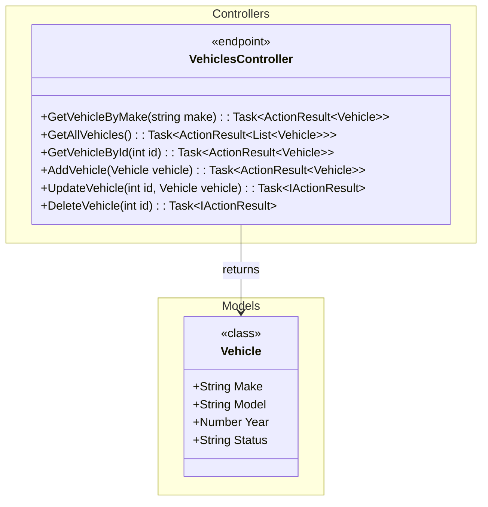

# Design session Vehicle management system

## Purpose

The design session is intended to cater for designing a Vehicle fleet mananagement tool

## Introduction

The design session is intended to cater for designing a Vehicle fleet mananagement tool

## Participants

| Participant   | Role             |
| ------------- | ---------------- |
| Alice Johnson | Project Manager  |
| Bob Smith     | Lead Developer   |
| Carol White   | UX Designer      |
| David Brown   | QA Engineer      |
| Eva Green     | Business Analyst |

## Logical view

The logical view of the Vehicle Management System (VMS) includes the following components:

1. **Vehicle Inventory**: Manages the list of vehicles, including their details such as make, model, year, and status.
2. **Fleet Management**: Handles the assignment of vehicles to drivers, scheduling maintenance, and tracking vehicle
   usage.
3. **Driver Management**: Manages driver information, including licenses, certifications, and driving history.
4. **Maintenance Management**: Tracks maintenance schedules, service history, and repair records for each vehicle.
5. **Reporting and Analytics**: Provides insights into fleet performance, vehicle utilization, and maintenance costs.

## Dynamic View
